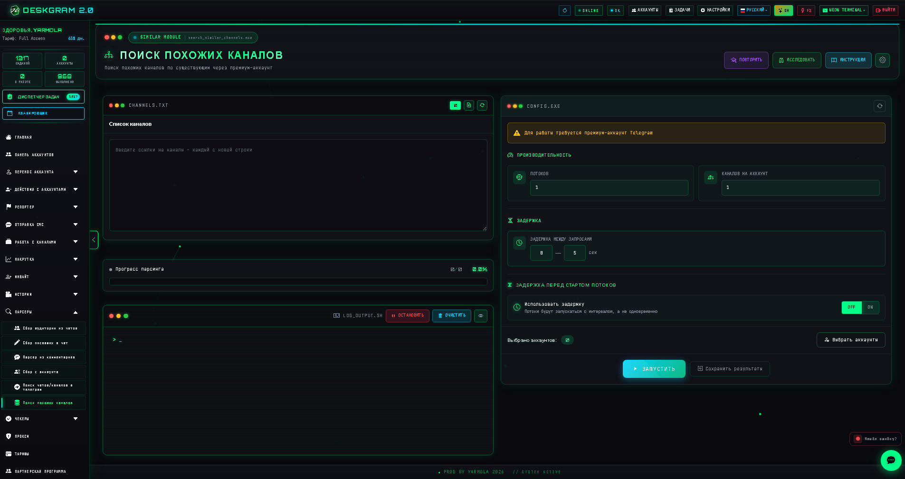
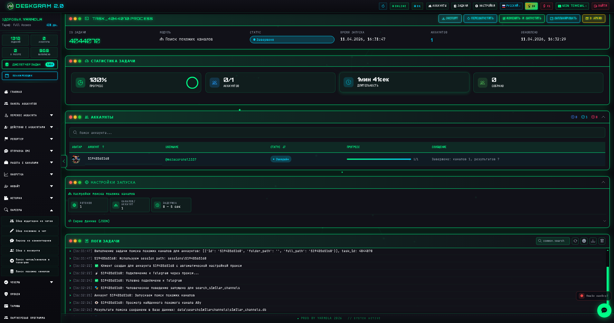
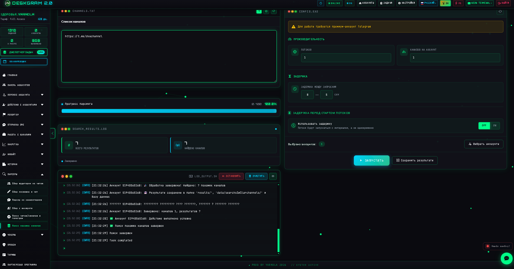

# Поиск похожих Telegram-каналов через Deskgram 2

Поиск похожих каналов в Deskgram 2 помогает расширять базу источников не только от ключевых слов, но и от уже известных площадок. Это хороший модуль для сценария, когда у вас есть несколько сильных каналов в нише, и вы хотите быстро найти соседние по тематике Telegram-площадки.

[Главный хаб Deskgram 2](https://github.com/Deskgram-2/deskgram-2-telegram-automation) · [Сайт](https://deskgram2.com/) · [Telegram-бот](https://t.me/DG2welcomebot) · [Web preview](https://deskgram2.com/web-preview)

## Скриншоты

## Кратко о модуле

| Параметр | Что внутри |
|---|---|
| Основная задача | Поиск похожих Telegram-каналов на основе исходных площадок |
| Важные блоки | Список исходных каналов, результаты, статистика, логи, настройки |
| Полезен для | Расширения базы, исследования ниши, поиска соседних источников |
| Связанные модули | Поиск каналов и групп, Сбор аудитории, Инвайт |

## Что умеет модуль

- брать список исходных каналов как опорную базу;
- находить похожие каналы и расширять карту ниши;
- показывать прогресс и статистику поиска;
- сохранять найденные площадки для следующей обработки;
- помогать строить более широкий discovery-сценарий.

## Быстрый старт

1. Подготовьте список каналов, которые уже подходят вашей нише.
2. Добавьте их в модуль как исходные площадки.
3. Запустите поиск похожих каналов.
4. Просмотрите результаты и отфильтруйте слабые варианты.
5. Передайте отобранные площадки в сбор аудитории или коммуникационные модули.

## Что логично делать после расширения базы

- [Сбор аудитории](https://github.com/Deskgram-2/telegram-audience-parser-deskgram), если нужно быстро перейти от площадок к базе пользователей;
- [Сбор из комментариев](https://github.com/Deskgram-2/telegram-comment-audience-parser-deskgram), если интересует аудитория с признаками вовлеченности;
- [Сбор писавших в чатах](https://github.com/Deskgram-2/telegram-active-chat-users-parser-deskgram), если рядом есть живые обсуждения и чаты;
- [Инвайт](https://github.com/Deskgram-2/telegram-invite-tool-deskgram), если discovery уже работает на рост каналов и групп;
- [Рассылка в ЛС](https://github.com/Deskgram-2/telegram-direct-messaging-deskgram), если найденные источники используются как входной слой для коммуникации;
- [Диспетчер задач](https://github.com/Deskgram-2/telegram-task-manager-deskgram), если нужно централизованно следить за поиском, парсингом и следующими сценариями.

## Как устроен сценарий

### Исходный список

Сначала вы задаете базу каналов, которые уже точно релевантны. От качества стартового списка напрямую зависит качество расширения.

### Расширение базы

Модуль находит соседние площадки, близкие к исходным. Это ускоряет масштабирование базы без повторного ручного поиска.

### Контроль качества

Статистика и лог помогают быстро отсекать шум, оценивать темп и проверять, какие площадки действительно подходят под задачу.

## Когда особенно полезен

- когда ниша уже понятна и есть несколько сильных seed-каналов;
- когда нужно быстро масштабировать список источников;
- когда вы хотите строить воронку от discovery к парсингу аудитории;
- когда ручной поиск уже начинает тормозить рост базы.

## Почему это сильнее ручного расширения

| Ручной подход | Поиск похожих каналов в Deskgram 2 |
|---|---|
| Нужно вручную искать соседние площадки | Модуль расширяет базу от seed-каналов |
| Высокий риск упустить релевантные каналы | Результаты собираются системно |
| Сложно масштабировать на много ниш | Один сценарий работает на серии исходных списков |
| Нет нормального контроля прогресса | Есть статистика и логи |

## Что выбрать: поиск похожих каналов или общий поиск по ключам

| Если задача такая | Лучше использовать |
|---|---|
| Уже есть несколько хороших seed-каналов | [Поиск похожих каналов](https://github.com/Deskgram-2/telegram-similar-channels-deskgram) |
| Нужно начинать без опорной базы площадок | [Поиск каналов и групп](https://github.com/Deskgram-2/telegram-channel-search-deskgram) |
| Нужен глубокий discovery в два шага | Сначала поиск по ключам, затем похожие каналы |
| Нужно просто расширить уже найденную нишевую карту | Поиск похожих каналов |

## FAQ для рабочих сценариев

### Когда этот модуль сильнее обычного keyword-search?

Когда у вас уже есть несколько по-настоящему релевантных площадок, и вы хотите расширяться от них, а не от гипотез по ключевым словам.

### Когда после похожих каналов логичнее идти в parser, а не в outreach?

Почти всегда, если цель — сначала получить базу пользователей. После discovery-расширения логичнее переходить в [сбор аудитории](https://github.com/Deskgram-2/telegram-audience-parser-deskgram), [сбор из комментариев](https://github.com/Deskgram-2/telegram-comment-audience-parser-deskgram) или [сбор писавших в чатах](https://github.com/Deskgram-2/telegram-active-chat-users-parser-deskgram).

### От чего зависит сила похожего поиска?

От качества seed-каналов: чем точнее исходная база, тем чище и полезнее будет расширение.

## Смежные репозитории

- [Главный хаб Deskgram 2](https://github.com/Deskgram-2/deskgram-2-telegram-automation)
- [Поиск каналов и групп](https://github.com/Deskgram-2/telegram-channel-search-deskgram)
- [Сбор аудитории](https://github.com/Deskgram-2/telegram-audience-parser-deskgram)
- [Инвайт](https://github.com/Deskgram-2/telegram-invite-tool-deskgram)
- [Сбор из комментариев](https://github.com/Deskgram-2/telegram-comment-audience-parser-deskgram)
- [Сбор писавших в чатах](https://github.com/Deskgram-2/telegram-active-chat-users-parser-deskgram)
- [Рассылка в ЛС](https://github.com/Deskgram-2/telegram-direct-messaging-deskgram)
- [Диспетчер задач](https://github.com/Deskgram-2/telegram-task-manager-deskgram)

## FAQ

### Чем этот модуль отличается от обычного поиска каналов?

Обычный поиск идет от ключевых слов, а этот сценарий идет от уже найденных или заранее известных каналов.

### Подходит ли это для масштабирования базы?

Да. Это один из самых удобных способов быстро расширять список площадок в нише.

### Что делать после поиска похожих каналов?

Обычно следующий шаг — сбор аудитории, анализ комментариев или подготовка базы под инвайт и коммуникацию.
